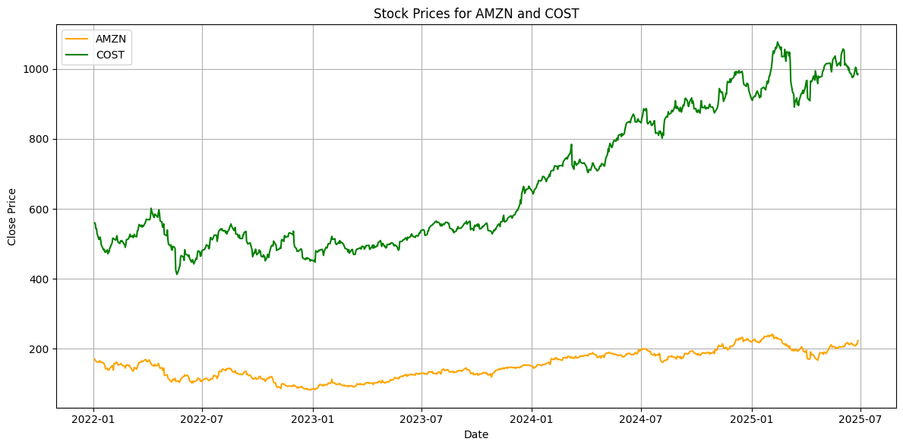
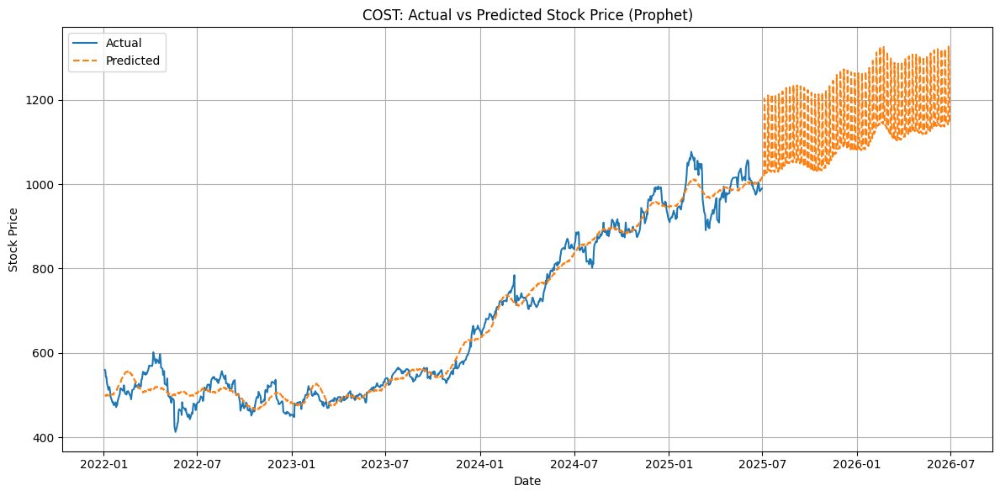

  

# StockVision: Forecasting Retail Stock Prices with Prophet and ARIMA

**StockVision** is a stock price forecasting project using time series models to predict the future prices of two retail giants — **Amazon (AMZN)** and **Costco (COST)**. It compares two beginner-friendly models — **Facebook Prophet** and **ARIMA** — on real stock data from 2022 to 2025, using graphs and error metrics.

---

## 📊 Project Goal

Forecast daily stock prices and compare which model is more reliable and accurate for short-term retail predictions.

---

## 📁 Dataset Info

- **Source**: World-Stock-Prices-Dataset.csv
- **Companies**: AMZN (Amazon), COST (Costco)
- **Date Range**: January 2022 – June 2025
- **Target Column**: Daily Closing Price

---

## 🔧 Project Structure

### 1. Facebook Prophet Forecasting

- Preprocessed data for Prophet (`ds`, `y` columns)
- Trained Prophet models for AMZN and COST
- Forecasted 365 days ahead
- Visualized:
  - Full forecast plot
  - Zoomed-in view
  - Trend and seasonality
  - 30-day and 90-day moving averages
- Evaluated predictions using MAE and RMSE

#### 📷 Prophet Forecast Sample (AMZN)

---

### 2. ARIMA Forecasting

- Checked stationarity with ADF Test
- Used differencing for stable signals
- Found p, d, q using ACF and PACF
- Trained ARIMA models separately for each stock
- Forecasted 30 days ahead
- Visualized:
  - Forecast vs Actual
  - Residual analysis (Q-Q Plot, Histogram)
- Evaluated using MAE and RMSE

#### 📷 ARIMA Forecast Sample (COST)

---

### 3. Model Comparison

- Extracted final 5-day predictions from both models
- Calculated and plotted:
  - MAE comparison
  - RMSE comparison
  - Daily forecast errors
- Wrote conclusion on which model did better

#### 📷 Model Comparison Chart

---

## 📈 Evaluation Metrics

| Ticker | Model   | MAE   | RMSE  |
|--------|---------|-------|--------|
| AMZN   | Prophet | 37.99 | 57.01 |
| AMZN   | ARIMA   | 3.26  | 4.06  |
| COST   | Prophet | 223.02| 236.57|
| COST   | ARIMA   | 5.34  | 7.16  |

---

## ✅ Conclusion

- **ARIMA** outperformed **Prophet** on both AMZN and COST.
- Prophet overestimated due to long forecast range and no growth cap.
- ARIMA stayed closer to the real prices and was better for short-term prediction.

---

## 🧠 Lessons Learned

- Prophet is great for quick trends and visualizations but needs tuning.
- ARIMA is more precise for shorter windows.
- Visual analysis and metrics helped us evaluate model reliability.

---

## 🔍 Future Improvements

- Add inflation or earnings as extra variables
- Try hybrid models like ARIMA + ML (XGBoost)
- Make an interactive dashboard using Streamlit

---

## 👨‍💻 Team

Muhammad A., Dieunie G., Pallavi V.  
**AI4ALL Ignite Program – Summer 2025**

---