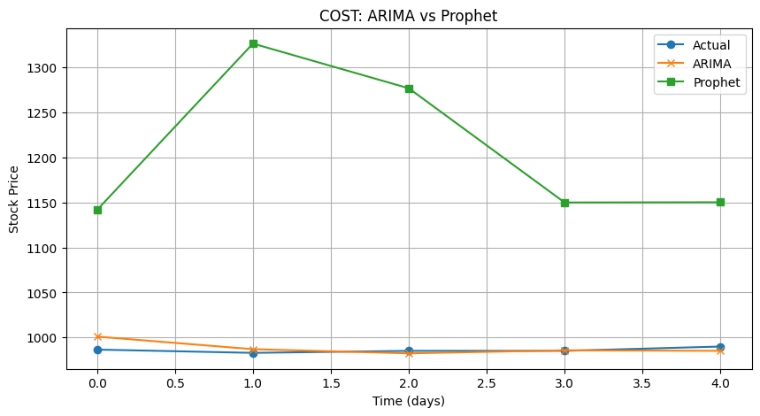

# StockVision: Forecasting Retail Stock Prices with Prophet and ARIMA

StockVision is a time series forecasting project that predicts future stock prices for two major retail companies, Amazon (AMZN) and Costco (COST). We compare two forecasting models, Facebook Prophet and ARIMA, using visualizations, evaluation metrics, and real stock data from 2022 to 2025.

## Project Goal

Predict short-term stock price movements and compare the performance of two beginner-friendly models:
- Facebook Prophet, simple and captures trends
- ARIMA, statistical model for time series patterns

## Dataset

- Source: World-Stock-Prices-Dataset.csv
- Tickers used: AMZN (Amazon), COST (Costco)
- Date range: January 2022 to June 2025
- Target: Daily closing stock prices

## Steps and Structure

### Data Preprocessing
- Filtered only AMZN and COST tickers
- Removed unrelated columns
- Formatted for Prophet (ds, y)
- Checked missing values

---

## Prophet Forecasting

We trained Facebook Prophet separately for Amazon and Costco. We forecasted 365 days into the future and plotted both full forecasts and trends.

### Example Forecast (Costco)

---

## ARIMA Forecasting

### Example Forecast (Amazon)

For ARIMA, we first checked if the data was stationary, used ADF tests and differencing, then used ACF and PACF to choose (p, d, q) values. We forecasted 30 future days and checked the residuals.

---

## Model Comparison

We compared Prophet and ARIMA using error metrics and side-by-side plots. ARIMA performed better overall for both stocks.

### Forecast Comparison

### MAE and RMSE Barplot

---

## Evaluation Metrics

| Ticker | Model   | MAE    | RMSE   |
|--------|---------|--------|--------|
| AMZN   | Prophet | 37.99  | 57.01  |
| AMZN   | ARIMA   | 3.26   | 4.06   |
| COST   | Prophet | 223.02 | 236.57 |
| COST   | ARIMA   | 5.34   | 7.16   |

---

## Conclusion

- ARIMA outperformed Prophet for both stocks
- Prophet overpredicted during some periods
- ARIMA gave more reliable short-term results
- Each model was trained separately for each ticker to match project instructions

---

## Lessons Learned

- ARIMA is better for short-term, small-range predictions
- Prophet gives more visual insights but can overfit
- Always check residuals and compare metrics

---

## Future Improvements

- Add external factors like inflation or news
- Try hybrid models (e.g. ARIMA + XGBoost)
- Deploy with Streamlit for interactive use

---

## Team

Muhammad A., Dieunie G., Pallavi V.  
AI4ALL Ignite Program, Summer 2025
