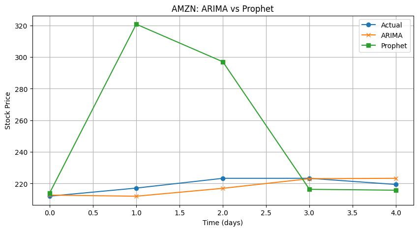

# StockVision: Forecasting Retail Stock Prices with Prophet and ARIMA

StockVision is a time series forecasting project that predicts future stock prices for two major retail companies, Amazon and Costco. The goal is to compare two models, Facebook Prophet and ARIMA, using real data from 2022 to 2025. This helps us see which model works better for short-term stock forecasting in retail.

## Project Goal

We are trying to predict short-term stock price movements and compare two models:
Facebook Prophet, which is easy to use and good at showing trends and patterns,
and ARIMA, which is a classic statistical model that handles patterns and noise in time series data.

## Dataset

Source used: World-Stock-Prices-Dataset.csv  
Tickers used: AMZN for Amazon and COST for Costco  
Date range: January 2022 to June 2025  
Target column: Daily closing stock prices

## Steps and Structure

### 1. Data Preprocessing

We filtered the data to include only AMZN and COST, removed extra columns, formatted it for Prophet using ds and y, and checked for any missing values.

---

### 2. Facebook Prophet Forecasting

We trained a separate Prophet model for both Amazon and Costco.  
Then we predicted 365 days into the future and visualized different parts of the forecast.

- Full forecast for each ticker
- Trend and seasonal breakdown
- Zoomed-in actual vs predicted plots
- Moving averages for 30-day and 90-day
- MAE and RMSE calculated

#### Prophet Forecast - Amazon

#### Prophet Forecast - Costco

---

### 3. ARIMA Forecasting

We did ADF tests to check for stationarity, differenced the data if needed, used ACF and PACF plots to choose parameters, then trained ARIMA models for both tickers.  
Forecasted 30 days ahead and plotted actual vs predicted results.

- Trained separate ARIMA models for each ticker
- Visualized predictions and residuals
- Calculated MAE and RMSE

#### ARIMA Forecast - Amazon

#### ARIMA Forecast - Costco

---

### 4. Model Comparison

In this part, we pulled final prediction arrays from both models, created visual comparisons, and used bar charts to compare errors like MAE and RMSE.

- Compared Prophet vs ARIMA visually
- Graphed forecast accuracy side-by-side
- Summarized which model did better

#### Forecast Comparison - ARIMA vs Prophet

#### MAE and RMSE Bar Plot

---

## Evaluation Metrics

| Ticker | Model   | MAE   | RMSE  |
|--------|---------|-------|--------|
| AMZN   | Prophet | 37.99 | 57.01 |
| AMZN   | ARIMA   | 3.26  | 4.06  |
| COST   | Prophet | 223.02| 236.57|
| COST   | ARIMA   | 5.34  | 7.16  |

---

## Conclusion

ARIMA performed better than Prophet on both Amazon and Costco.  
Prophet predicted values that were too high, especially since it was forecasting further into the future.  
ARIMA stayed closer to the actual prices and worked better for short-term predictions.  
We trained and evaluated each model separately for each ticker to make sure our results were accurate and clear.

---

## Lessons Learned

- ARIMA is great for short-term forecasting when you want more accurate numbers
- Prophet is beginner friendly and gives a lot of helpful graphs but sometimes overpredicts
- Always look at residual plots and prediction charts to see how good your model really is

---

## Future Improvements

- Add extra columns like inflation or earnings to Prophet
- Try combining models like ARIMA and XGBoost
- Make a Streamlit app for live model predictions

---

## Authors

Muhammad A., Dieunie G., Pallavi V.  
AI4ALL Ignite Program, Summer 2025